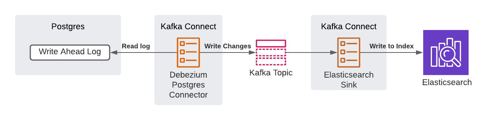

# Intro
Change data capture is the idea of capturing data changes so they can be propagated to down stream systems.

# Implementation
Change data capture is implemented using Postgres as a source of truth data base and Kafka as the message broker to integrate systems.

Elasticsearch is used to create a materialized view of the data in Postgres. 

Kafka connect is the tool used to integrate the endpoints.

Debezium is the library used to implement change data capture. The Debezium Postgres Connector monitors Postgres's write ahead log for changes.
These changes are captured and put on a Kafka topic, so a consumer for Elasticsearch can process the changes and store them in the proper index.
If the Postgres connector fails, it will keep track of where it left off in the write ahead log and continue.

This provides incremental updates rather than having to rebuild the entire index, which is costly.

The following diagram shows the dataflow



# How to Run
```bash
docker compose up --build
```

# Setup Steps
1. Start services
2. Initialize database (create tables/insert data)
3. Deploy Postgres connector
4. Deploy Elasticsearch sink
5. Look for the data in Elasticsearch 

# Future Work
* Explore full sync
    * Maybe just use the PostgresJdbcConnector from Confluent and read the table
* Explore how to detect when Elasticsearch is out of sync with the main database
* How to join data
* How does compaction work? 

# Appendix
## Links
* https://debezium.io/documentation/reference/1.5/connectors/postgresql.html
* https://github.com/debezium/debezium-examples/tree/master/unwrap-smt
* https://www.confluent.io/blog/kafka-elasticsearch-connector-tutorial/
## Helpful Commands
### Log in to Postgres
```bash
psql --user $POSTGRES_USER -d test_db
```
### List Topics
```bash
/opt/kafka/bin/kafka-topics.sh --list --zookeeper zookeeper
```
### Read Users Topic
```bash
/opt/kafka/bin/kafka-console-consumer.sh --from-beginning --topic=users --bootstrap-server localhost:9092
```
### Check Connect Status
```bash
/opt/kafka/bin/kafka-console-consumer.sh --from-beginning --topic=connect-status --bootstrap-server localhost:9092
```